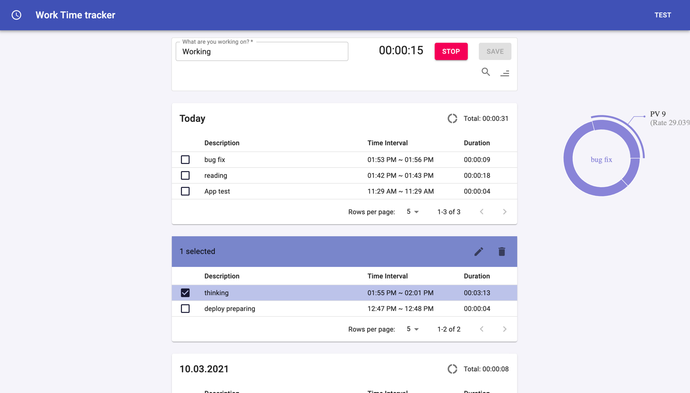

## Project "Work Time Tracking"

#### The fullstack time tracking app (in progress...)

http://ceobit.me/  

demo profile:  
login: Roman  
password: 123456  

### Features:

<ul>
<li>Registration with username and password</li>
<li>Login to the app</li>
<li>Logout of the app</li>
<li>User ables to create time records with date, length of time and a note</li>
<li>User ables to sort time records based on date and length of time</li>
<li>User ables to filter time records by start date (from date, to date)</li>
<li>User ables to change and delete time records</li>
</ul>

it's possible to perform all user actions via the REST API, including authentication  

Unit and e2e tests were used

### Stack:
React JS (Hooks)  
Redux  
NodeJS  
ExpressJS  
MongoDB  
Material UI  
